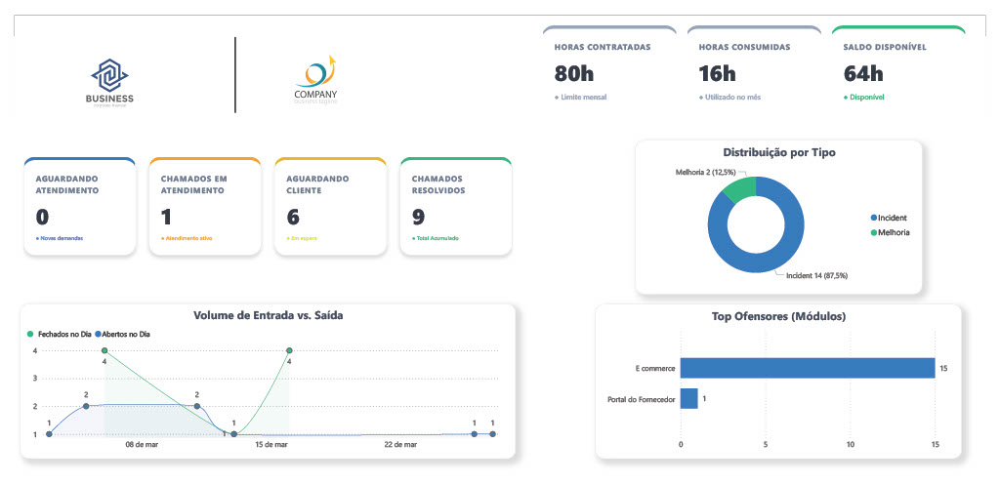
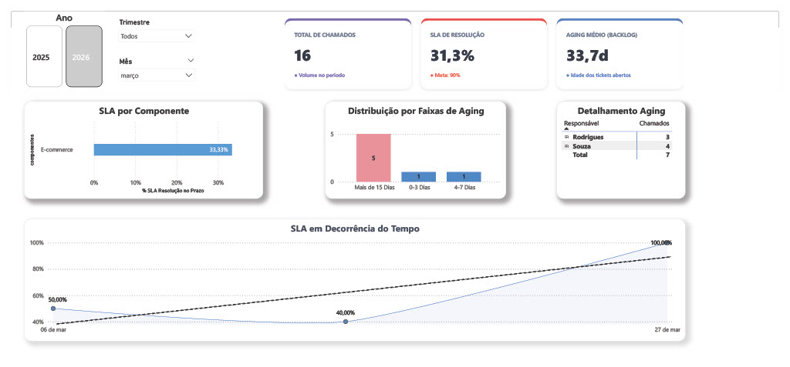

# [Seu Nome Completo] - Portfólio de Análise de Dados

## Olá, e bem-vindo!

Sou um Analista de Dados com foco em transformar grandes volumes de dados em insights acionáveis que impulsionam decisões de negócios e otimizam operações. Minha expertise está no desenvolvimento de soluções de ponta a ponta, desde a coleta e limpeza de dados até a criação de visualizações de dados interativas e estratégicas.

Abaixo, apresento um exemplo do meu trabalho focado em **Gestão de Tickets e Desempenho de Suporte**. Este projeto demonstra minha capacidade de criar visibilidade e métricas de desempenho para uma operação de serviços de TI.

---

## 🚀 Dashboards de Destaque: Gestão de Tickets e Performance de SLA

Este projeto de demonstração simula um cenário corporativo onde uma equipe de suporte técnico ou atendimento precisa de visibilidade clara para gerenciar sua carga de trabalho, prazos e eficiência.

### Painel 1: Visão Geral e Gestão de Operações

O primeiro painel fornece uma visão macro da operação, focado na gestão do banco de horas, status em tempo real e identificação de gargalos.

**Principais Insights e Recursos Demonstreados:**

* **Gestão de Banco de Horas:** Acompanhamento preciso do saldo de horas contratadas vs. consumidas (Contratadas 80h | Consumidas 16h | Saldo 64h), crucial para conformidade e faturamento.
* **KPIs de Status em Tempo Real:** Visualização instantânea do backlog de chamados (Aguardando Atendimento, Em Atendimento, Aguardando Cliente) e total de chamados resolvidos.
* **Análise de Volume Temporal:** Gráfico de série temporal comparando o volume de tickets abertos vs. fechados por dia (Março), permitindo a identificação de tendências e picos de demanda.
* **Identificação de Principais Problemas (Top Ofensores):** Um gráfico de barras que destaca os módulos (ex: E-commerce) que geram a maior parte dos chamados, permitindo intervenções preventivas direcionadas.
* **Distribuição de Tipos:** Gráfico de pizza mostrando a proporção de Incidentes (87,5%) vs. Melhorias (12,5%), orientando a alocação de recursos da equipe.

---

### Painel 2: Análise de Desempenho e SLA

O segundo painel mergulha na conformidade e eficiência, focado no monitoramento de SLAs (Acordos de Nível de Serviço) e tempo de envelhecimento do backlog.

**Principais Insights e Recursos Demonstreados:**

* **Monitoramento de KPI de SLA:** Acompanhamento mensal do SLA de Resolução (31,3% para o mês de Março), comparado diretamente com a meta (Meta: 90%), expondo lacunas de desempenho.
* **Análise de Aging (Envelhecimento) do Backlog:**
    * Monitoramento do Aging Médio (33,7 dias), indicando que tickets estão ficando abertos por muito tempo.
    * Gráfico de barras mostrando a distribuição do aging por faixas, destacando o acúmulo de tickets com mais de 15 dias.
* **Detalhamento Granular:** Tabela que atribui a carga de tickets do backlog a responsáveis específicos (ex: Rodrigues, Souza), permitindo a gestão direta da carga de trabalho.
* **SLA por Componente:** Identificação do SLA por área (ex: E-commerce), permitindo focar os esforços de melhoria nos componentes de menor desempenho.
* **Evolução e Tendência do SLA:** Um gráfico de série temporal mostrando a evolução do SLA ao longo do tempo com uma linha de tendência, essencial para planejar melhorias contínuas.

---

## 🛠️ Habilidades e Ferramentas Demonstradas nestes Projetos:

* **Ferramentas:** Power BI , SQL, Excel, Git.
* **Visualização de Dados (Data Visualization):** Design de painéis de controle e KPIs, storytelling com dados.
* **Análise de Negócios:** Definição e monitoramento de KPIs (SLA, Aging, Banco de Horas), análise de tendências de série temporal.
* **Processamento de Dados (Inferido):** Limpeza e modelagem de dados para análise de conformidade e tempo de ciclo.

## Vamos conversar?

Estou aberto a novas oportunidades e parcerias em análise de dados. Você pode me encontrar nos seguintes canais:

* 🔗 **LinkedIn:** www.linkedin.com/in/daniel-carvalho-de-souza-a32886118
* 📧 **E-mail:** contatocarvalhos@gmail

---
© [Ano Atual] [Seu Nome Completo]
